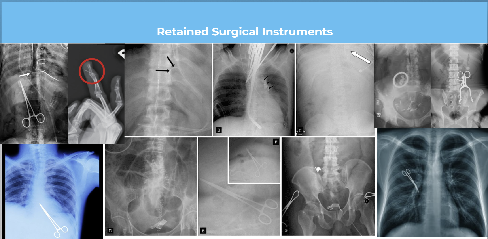
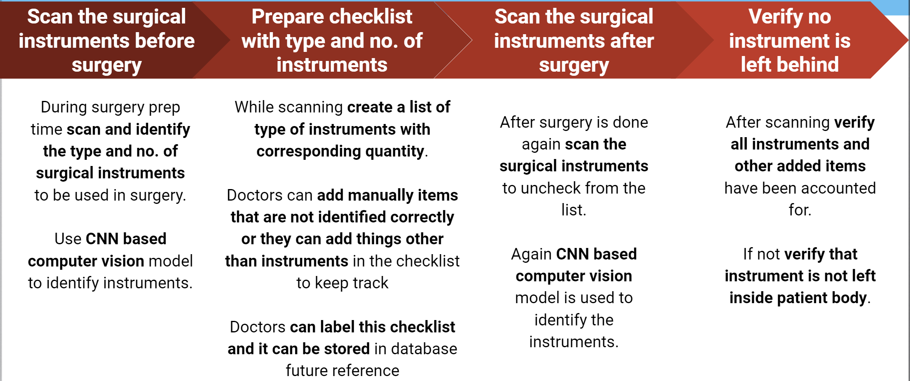
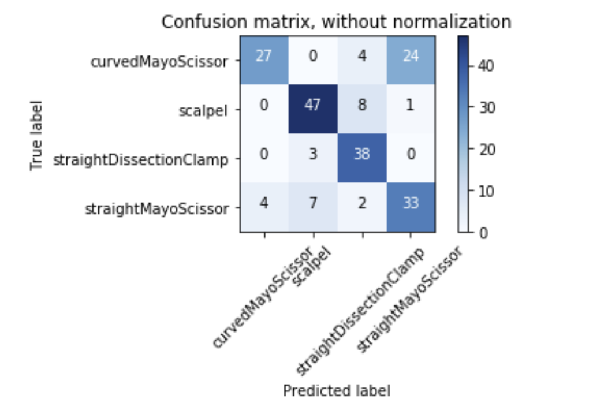
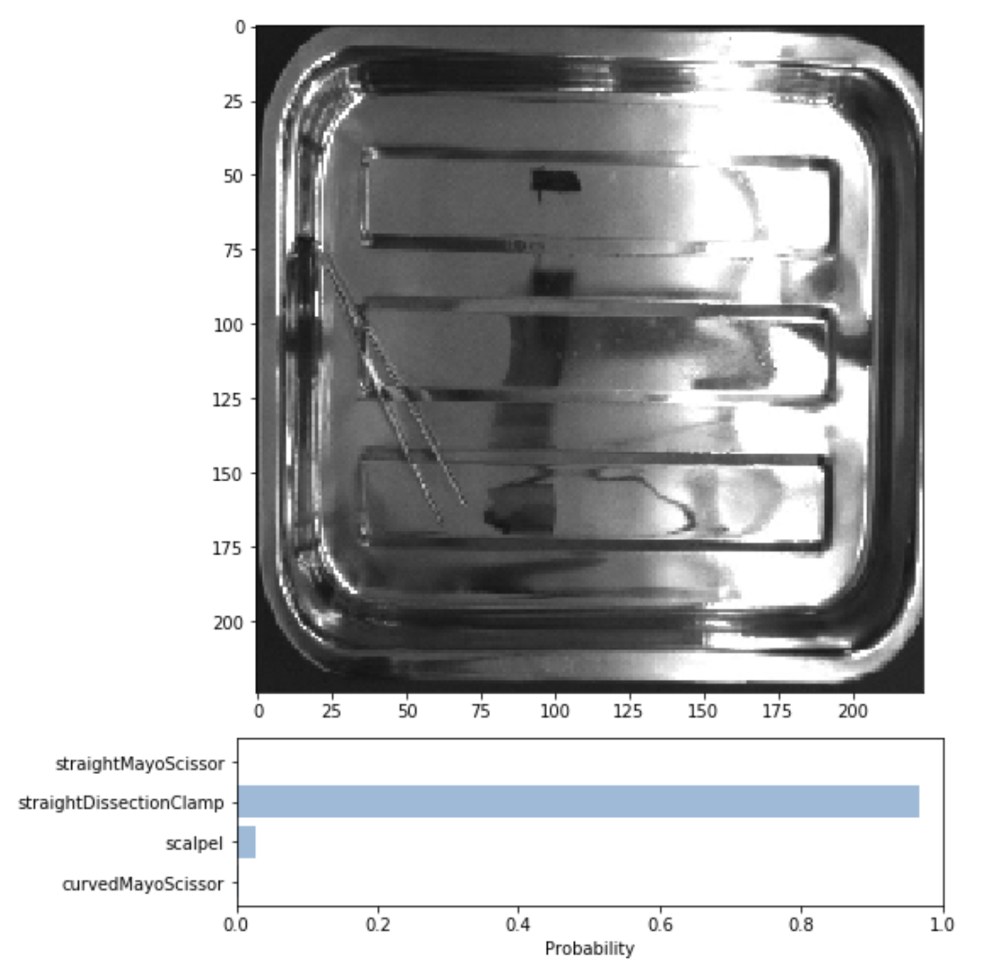

# SurgeonAssist.
> SurgeonAssist is a computer vision based application to detect, identify, and track the usage of surgical instruments during surgery to prevent surgical instrument retention.
  

## Table of contents
* [General info](#general-info)
* [Application Flow Chart](#application-flow-chart)
* [Features](#features)
* [Code](#code)
* [Results](#results)

## General info
* Dataset for the project is taken from [kaggle](https://www.kaggle.com/dilavado/labeled-surgical-tools).
* Used transfer learning model “MobileNet” with “imagenet” weights.
* Dataset includes 4 surgical instruments -  Curved Mayo Scissor, Scalpel, Straight Dissection Clamp, Straight Mayo Scissor.
* Accuracy of the trained model is around 80%.
* Major challenge was to differentiate Curved Mayo Scissor from  Straight Mayo Scissor as both look similar.

## Application Flow Chart
* Below is the application flow chart.
 

## Code
* [Model Training, validation and testing.](https://github.com/jainsanyam786/SurgeonAssist/blob/main/SurgeonAssist_Transfer_Learning.ipynb)
* Jupyter-notebook to test [basic functionality](https://github.com/jainsanyam786/SurgeonAssist/blob/main/Interactive_UI_to_test_functionality.ipynb)
 
## Results
* Confusion matrix for the trained model.

* Result for a an sample image.

